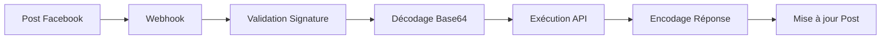

# 🎩 AlfredBridge

AlfredBridge agit comme votre majordome digital, gérant élégamment les interactions entre Facebook et vos APIs.

[](https://vercel.com/new/clone?repository-url=https%3A%2F%2Fgithub.com%2FRadouaneElarfaoui%2FAlfredBridge)


## 📑 Table des Matières
- [Fonctionnalités](#-fonctionnalités)
- [Installation](#-installation)
- [Configuration](#-configuration)
- [Documentation API](#-documentation-api)
- [Sécurité](#-sécurité)
- [Déploiement](#-déploiement)
- [Licence](#-licence)
- [Contact](#-contact)

## 🌟 Fonctionnalités

- 🤖 Gestion automatisée des webhooks Facebook
- 🔐 Encodage/décodage sécurisé en base64
- 🧪 Interface de test interactive
- 📡 Relais intelligent des messages vers vos APIs
- 📊 Historique des webhooks avec pagination
- ⚡ Déploiement facile sur Vercel

## 🏗️ Architecture



## 🚀 Installation

```bash
# Installation
git clone https://github.com/RadouaneElarfaoui/AlfredBridge.git
cd AlfredBridge

# Configuration
cp .env.example .env
# Éditer .env avec vos identifiants

# Installation des dépendances
pip install -r requirements.txt

# Lancement
flask run
```

## ⚙️ Configuration

### Variables d'Environnement Requises
```env
FACEBOOK_APP_SECRET=your_app_secret
FACEBOOK_VERIFY_TOKEN=your_verify_token
FACEBOOK_PAGE_ACCESS_TOKEN=your_page_access_token
FACEBOOK_API_VERSION=v20.0
FACEBOOK_DEFAULT_PAGE_ID=your_page_id
DEBUG=False
MAX_HISTORY_SIZE=100
```

### Configuration Facebook
1. Créez une application sur [Facebook Developers](https://developers.facebook.com)
2. Activez les Webhooks pour votre Page
3. Configurez l'URL du webhook avec votre domaine
4. Utilisez le token de vérification défini dans `.env`

## 📖 Documentation API

### Endpoints
- `GET /webhook` : Validation du webhook Facebook
- `POST /webhook` : Réception des événements Facebook
- `GET /test` : Interface de test interactive
- `GET /webhook/history` : Historique des webhooks avec pagination

### Format de Requête API

#### Format de Base
```json
{
    "request": {
        "method": "GET|POST|PUT|DELETE",
        "url": "https://api.exemple.com/endpoint"
    },
    "metadata": {
        "platform": "votre_plateforme",
        "api_version": "v1"
    }
}
```

#### Format Complet avec Toutes les Options
```json
{
    "request": {
        "method": "POST",
        "url": "https://api.exemple.com/endpoint",
        "headers": {
            "Authorization": "Bearer votre_token",
            "Content-Type": "application/json",
            "Accept": "application/json"
        },
        "params": {
            "param1": "valeur1",
            "param2": "valeur2"
        },
        "data": {
            "cle1": "valeur1",
            "cle2": "valeur2"
        }
    },
    "metadata": {
        "platform": "votre_plateforme",
        "api_version": "v1",
        "source": "web-client"
    }
}
```

#### Détails des Champs
- **Champs Obligatoires**:
  - `request.url`: URL de l'API à appeler
  - `request`: Objet parent contenant les détails de la requête

- **Champs Optionnels**:
  - `method`: Méthode HTTP (GET par défaut)
  - `headers`: En-têtes HTTP personnalisés
  - `params`: Paramètres de requête URL (query string)
  - `data`: Corps de la requête (pour POST/PUT)
  - `metadata`: Informations supplémentaires

### Format de Réponse

#### Réponse Réussie
```json
{
    "response": {
        "status": {
            "code": 200,
            "reason": "OK"
        },
        "headers": {
            "content-type": "application/json",
            "server": "nginx"
        },
        "data": {
            "resultat": "données de réponse"
        },
        "timing": {
            "elapsed": "0.234s",
            "timestamp": "2024-03-14T12:00:00Z"
        }
    },
    "request": {
        "method": "POST",
        "url": "https://api.exemple.com/endpoint"
    },
    "metadata": {
        "platform": "web",
        "api_version": "v1",
        "client_info": {
            "type": "api_client",
            "version": "1.0"
        },
        "request_id": "550e8400-e29b-41d4-a716-446655440000"
    }
}
```

#### Réponse d'Erreur
```json
{
    "error": {
        "type": "ConnectionError",
        "message": "Failed to establish connection",
        "timestamp": "2024-03-14T12:00:00Z"
    },
    "request": {
        "method": "POST",
        "url": "https://api.exemple.com/endpoint"
    },
    "metadata": {
        "platform": "web",
        "api_version": "v1",
        "request_id": "550e8400-e29b-41d4-a716-446655440000"
    }
}
```

### Important à Noter
1. **Encodage Base64**: 
   - Le JSON de requête doit être encodé en base64 avant d'être publié sur Facebook
   - La réponse sera automatiquement décodée et mise à jour dans le post Facebook

2. **Gestion des Erreurs**:
   - Toutes les erreurs sont capturées et formatées dans la réponse
   - Le champ `error.type` indique le type d'erreur rencontrée
   - Le champ `error.message` fournit des détails sur l'erreur

3. **Traçabilité**:
   - Chaque requête reçoit un `request_id` unique
   - Les timestamps sont inclus pour le suivi temporel
   - Le temps d'exécution (`elapsed`) est mesuré pour chaque requête

## 🔒 Sécurité

- Validation des signatures webhook Facebook
- Encodage/décodage base64 des messages
- Gestion des timeouts et erreurs
- Validation des données JSON
- Historique sécurisé des requêtes

## 📦 Déploiement

### Vercel
[](https://vercel.com/new/clone?repository-url=https%3A%2F%2Fgithub.com%2FRadouaneElarfaoui%2FAlfredBridge)

### Docker
```bash
docker build -t alfredbridge .
docker run -p 5000:5000 alfredbridge
```

## 📝 Licence

MIT License - Voir [LICENSE](LICENSE)

## 📫 Contact

[Radouane Elarfaoui](https://github.com/RadouaneElarfaoui)

---
Projet: [https://github.com/RadouaneElarfaoui/AlfredBridge](https://github.com/RadouaneElarfaoui/AlfredBridge)